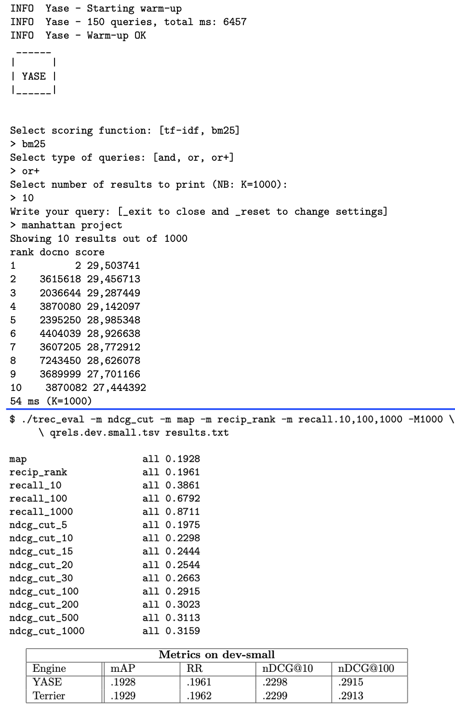

# YASE
YASE is a search engine capable of providing search results for the **MS Marco document collection** (dataset is available on GitHub).
In particular YASE has:
- an indexer that creates: an inverted index (with skipping blocks), a lexicon and a document index
- a query processor that allows the user to perform conjunctive and disjunctive free text queries. (It implements both TF-IDF and BM25 scoring functions).

Furthermore, YASE employs dynamic pruning techniques such as MaxScore in order to boost the performances of disjunctive queries. The search engine also adopts simple compression techniques (variable bytes and unary) to reduce the size of the inverted index, in order to be efficient in terms of memory usage while maintaining a fast research response.  

**NOTE** Some files are avaliable here https://drive.google.com/drive/folders/13oxrPoda-8V5NOw3DzhLom-TOfcda7Uu?usp=drive_link:
* You need to place results.txt of the drive in the 'trec\_eval' folder of the project
* You need to place the 'structures' folder and collection.tar.gz of the drive in *SearchEngine/src/main/resources/* 

Alternatively you can just copy the collection.tar.gz and reconstruct all the other files

[Here1](requirements.pdf) there are the requirements of the project and [here2](documentation.pdf) is available the complete documentation 

## Main goals are:
- Develop the code to create the inverted index with skipping blocks
- Implement conjunctive and disjuctive queries
- Perform the index compression

## Preview:

   

